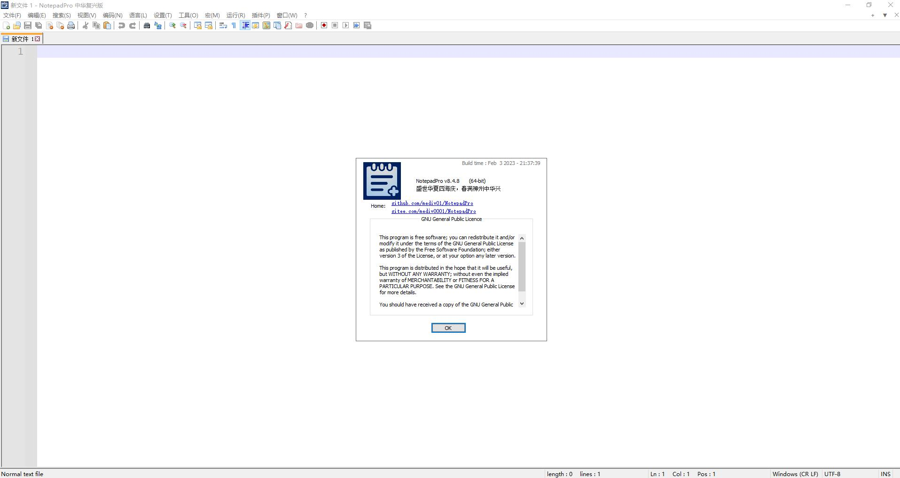

NotepadPro介绍
===================

&nbsp;&nbsp;&nbsp;&nbsp;

NotepadPro是一个免费的开源文本编辑器，支持多种编程语言和自然语言。 NotepadPro来自Notepad++重新编译，目前支持Windows环境下X64版本以及X86版本。 NotepadPro在[GPL License](LICENSE)下发布。

NotepadPro在[Github](https://github.com/mediv01/NotepadPro) 社区以及[Gitee](https://gitee.com/mediv0001/NotepadPro)社区上同步发行。

Github社区：[https://github.com/mediv01/NotepadPro](https://github.com/mediv01/NotepadPro)

Gitee社区：[https://gitee.com/mediv0001/NotepadPro](https://gitee.com/mediv0001/NotepadPro)

为什么要选择使用NotepadPro？
------------
NotepadPro基于Notepad++重新编译，不仅兼容Notepad++历史插件，而且剔除了Notepad++中不恰当的政治言论，坚定不移地维护了中华民族统一的立场。中国大陆地区的开发者可以放心的使用NotepadPro，而不必担心其里面隐含的政治言论。

此外，Notepad++作者曾提出如果不同意其政治观点，Notepad++可能会在源代码文件里插入随机乱码破坏文件。根据目前GIT源代码提交记录，NotepadPro源代码中没有这一恶意功能，大家可以放心使用，未来也会加倍注意，避免恶意代码合入NotepadPro分支。

除了正常版本，NotepadPro还提供了主旋律版，功能与正常版完全相同，仅仅在软件标题处显示为“中华复兴版”以及在关于本软件处显示“盛世华夏四海庆，春满神州中华兴”

作者本人在工作以及生活中也在使用NotepadPro软件，主要用NotepadPro处理一些文本文件的编辑、日志查看以及文本备忘录生成等内容。对于软件使用中存在的问题，作者也会尽力修复。

NotepadPro与其他文本编辑软件的优缺点比较
------------
NotepadPro是个轻量级的文本编辑软件，打开速度快，占用内存小，适合用于日志查看、文件备忘录、文本文件编辑等功能。它也能用于写代码，但是代码联想提示功能比较弱，不如VSCode,IDEA之类的代码IDE工具。

作者建议写前后端代码时（C++、Javascript、Java等），可以使用其他IDE工具。NotepadPro更适合处理轻量级文本编辑任务。

NotepadPro是否免费，是否可以加入开发者团队？是否可以修改重新发行？
------------
NotepadPro是个遵守[GPL License](LICENSE)的开源免费软件，大家完全可以免费在个人电脑以及公司电脑使用。如果你有好的开发建议，也欢迎加入NotepadPro开发团队。NotepadPro遵守[GPL License](LICENSE)，您可以在遵守[GPL License](LICENSE)的情况下，修改源代码并重新发行。

关于作者
------------
NotepadPro的作者是mediv01，中国大陆地区某大型公司程序员，主要使用Java语言进行开发，业余的时候也会做一些C++、Python开源项目。本软件完全免费，如果你喜欢本软件，也欢迎赞助。

项目赞助地址：
